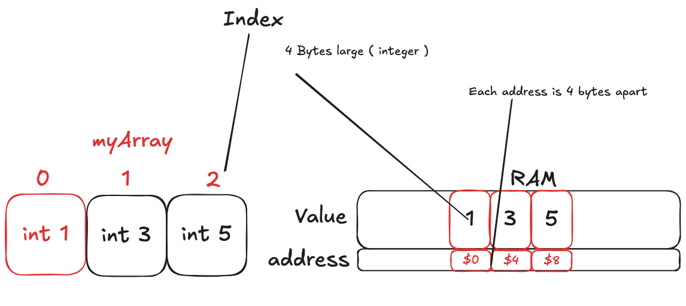

# Implementing a Static Array in C

## Static Arrays

A static array are a fundamental data structure that stores a fixed number of elements of the same type.

We can think of static arrays as a contiguous block of memory; meaning when looking at the memory addresses of the array, we can see that the elements are next to each other are seperated by the size of the data type. For an array of int, which typically occupies 4 bytes (on most platforms), each successive element's address is indeed 4 bytes apart.



Static arrays have a predeteremined size that is set when the array is created. This property makes them memory efficient.

When peforming generic actions on a static array; we have the following operations and its associated time complexities:

| Operation | Big-O Time |
|-----------|------------|
| Read/Write i-th element | O(1) |
| Insert/Remove End | O(1) |
| Insert Middle | O(n) |
| Remove Middle | O(n) |

## Implementing a Static Array in C

First, we need to define the maximum size of the array.

As we stated before, we need to define the maximum size of the array.

in C, we can do this by using the `#define` directive.

<details>
<summary>Click to see definition of #define directive</summary>

'In the C Programming Language, the #define directive allows the definition of macros within your source code. These macro definitions allow constant values to be declared for use throughout your code.' [@TechOnTheNet](https://techonthenet.com/c_language/constants/create_define.php)
</details>

```c
#define MAX_SIZE 32
```

We will use this constant to define the size of our static array. we will also use this constant to allocate memory for our array. as stated before, each element in our array will occupy 4 bytes.

before we can proceed, we need to define a custom type for our static array. we can do this by using the `typedef` directive. we also need to strictly define the data type of the elements that our array will store. in this case, we will use `int`. we create two members for our custom type:

- `_data`: a pointer to the array
- `size`: the size of the array

a pointer is used to store the address of the first element of the array. we will use this pointer to access the array elements. this pointer is a integer pointer and it points to the first element of the array.

```c
typedef struct {
    int* _data;
    int size;
} StaticArray;
```

<details>
<summary>Click to see definition of typedef directive</summary>

'The typedef is a keyword that is used to provide existing data types with a new name. The C typedef keyword is used to redefine the name of already existing data types... typedef can also be used with structures in the C programming language. A new data type can be created and used to define the structure variable.' [@GeeksforGeeks](https://www.geeksforgeeks.org/typedef-in-c/)
</details>

<details>
<summary>Click to see definition of 'type' in the context of C</summary>

'Each variable in C has an associated data type. It specifies the type of data that the variable can store like integer, character, floating, double, etc. Each data type requires different amounts of memory and has some specific operations which can be performed over it.' [@GeeksforGeeks](https://www.geeksforgeeks.org/data-types-in-c/)
</details>

now that we have defined our custom type, we can proceed to initialize our static array.

## Why do we need to initialize our static array? 

<details>
<summary>Why do we need to initialize our static array?</summary>

After defining the structure of our static array, initialization is crucial for the following reasons:

### 1. Memory Allocation: 
When we define our static array structure, we're essentially creating a blueprint. This blueprint includes a pointer to where our data will be stored, but it doesn't actually reserve any memory for that data. Initialization is where we allocate the necessary memory to store our array elements.

### 2. Setting Initial State:
Initialization allows us to set the array to a known, valid starting state. This typically involves setting the size to zero, indicating an empty array. Without this step, the size could contain arbitrary data, leading to incorrect behavior in our operations.

### 3. Preventing Undefined Behavior:
In many programming languages, including C, using uninitialized memory can lead to undefined behavior. This means the program might crash, produce incorrect results, or even appear to work correctly but fail unpredictably later. Proper initialization ensures we're always working with defined, valid memory.

### 4. Resource Management:
Initialization often involves allocating resources (in this case, memory). This sets the stage for proper resource management throughout the lifecycle of our array, including eventual deallocation when the array is no longer needed.

### 5. Consistency and Reliability:
Having an initialization step ensures that every instance of our static array starts in the same, known state. This consistency is crucial for reliable behavior across different parts of a program or different runs of the same program.

In essence, initialization bridges the gap between our abstract definition of a static array and a concrete, usable instance in memory. It's a critical step in bringing our data structure to life in a way that's safe, predictable, and ready for operation.
</details>

now that we have understood the importance of initialization, we can proceed to implement the initialization function for our static array.

## Initializing our static array

```c
void initStaticArray(StaticArray* arr) {
    arr->_data = (int*)malloc(MAX_SIZE * sizeof(int));
    arr->size = 0;
}
```

we define our function with `void` keyword because it does not return any value

we have one single parameter, which is a pointer to our static array. we use the `*` operator to indicate that this parameter is a pointer to our static array.

we use the `malloc` function to allocate memory for our array. the `malloc` function takes a single argument, which is the number of bytes to allocate. in this case, we multiply the `MAX_SIZE` constant by the size of an `int` to get the total number of bytes to allocate.

the return value of the `malloc` function is a pointer to the allocated memory. we assign this pointer to the `_data` member of our static array.

we use the `(int*)` cast to tell the compiler that the return value is a pointer to an integer.

we set the `size` member of our static array to 0 to indicate that our array is empty.

## Adding elements to our static array

adding elements to our static array is a simple process. we need to check if the array is already full. if it is, we need to print an error message and exit the program. if it is not, we can add the new element to the end of the array.

```c
void addElement(StaticArray* arr, int value) {
    if (arr->size >= MAX_SIZE) {
        fprintf(stderr, "Array is full\n");
        exit(1);
    }
}
```

again we use void because this function does not return any value.

we have two parameters:

- a pointer to our static array
- the value of the element to add

we use the `if` statement to check if the array is already full. if it is, we use the `fprintf` function to print an error message and the `exit` function to exit the program.

we use the `>=` operator to check if the array is already full.

we use the `fprintf` function to print an error message. the `stderr` stream is used to print the error message to the standard error stream, which is typically the terminal or command prompt.

we use the `exit` function to exit the program. the `1` argument is the exit status. in C, a status of `0` indicates success, and a status of `1` indicates failure.

```c
    *(arr->_data + arr->size) = value;
    arr->size++;
```

we use the `*(arr->_data + arr->size)` expression to access the memory address of the next empty spot in our array. we then assign the value of the element to add to this memory address.

when we use the `*( ... )` expression, we are essentially saying "go to the memory address of ... and assign the value to it".

so when we peform the calculation `arr->_data + arr->size`, we are essentially saying "give me the memory address of the first element of our array and move forward `arr->size` elements".

we then use the `*` operator to dereference the memory address and assign the value to it.

we then increment the `size` member of our static array to indicate that we have added a new element.